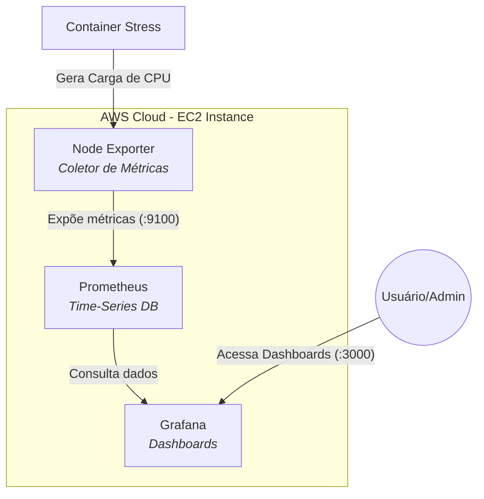
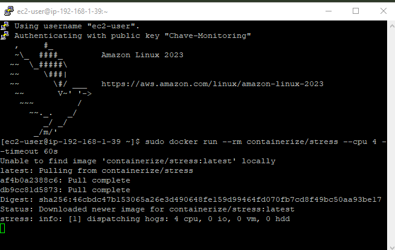
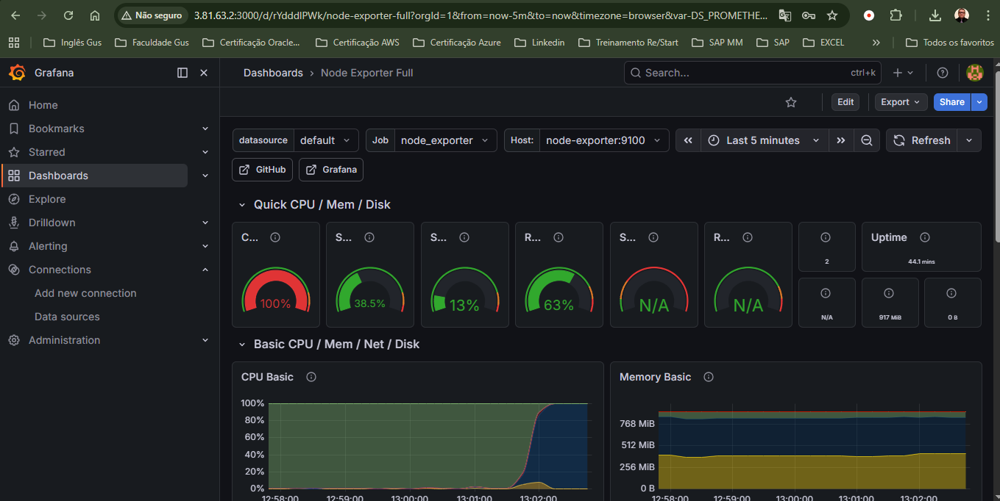
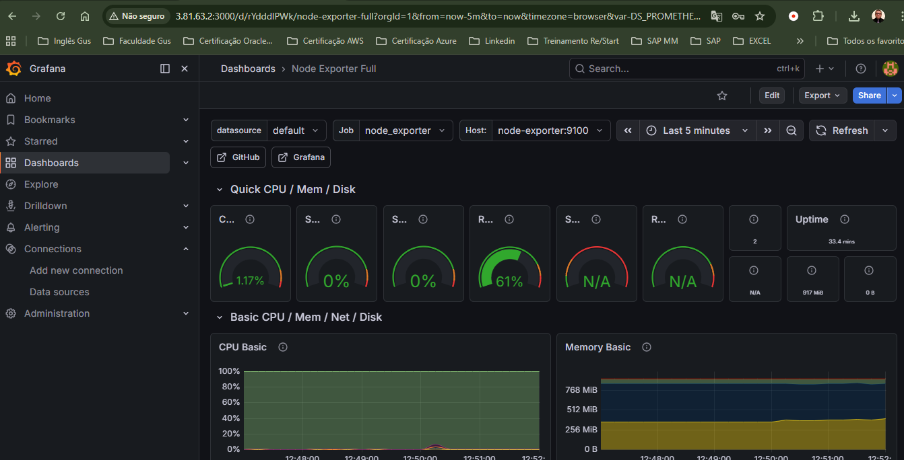

# 📊 AWS Cloud Observability: Monitoramento Estratégico com Prometheus & Grafana

## 🎯 Por que este projeto existe?
No cenário de computação em nuvem, "quem não mede, não gerencia". Este projeto nasceu da necessidade de transformar dados brutos de infraestrutura em **inteligência de negócio**. O objetivo foi criar uma stack de monitoramento de baixo custo e alta performance para garantir a disponibilidade e a saúde de aplicações rodando em instâncias AWS EC2.

---

## 🏗️ Arquitetura do Projeto
Abaixo, o fluxo de dados e a estrutura de containers orquestrada na AWS:

---

## 🚀 Validação Técnica e Stress Test
Para provar a eficácia da ferramenta, realizei um **Stress Test** simulando uma carga pesada de processamento:

### 1️⃣ O Gatilho (Stress via Container)

> *Execução do container de stress via SSH para elevar o uso de recursos do sistema.*

### 2️⃣ A Resposta (Observabilidade em Ação)

> *O dashboard reagiu instantaneamente ao pico de CPU atingindo 100%.*

---

## 🧠 Desafios e Soluções (Raciocínio Lógico)

| Desafio | Solução e Raciocínio |
| :--- | :--- |
| **Persistência de dados** | O Prometheus perdia o histórico ao reiniciar. Implementei **Docker Volumes** para mapear os dados do container para o disco da EC2, garantindo durabilidade. |
| **Segurança e Exposição** | Abrir portas públicas é arriscado. Configurei **Security Groups na AWS** para restringir o tráfego e usei redes internas do Docker para a comunicação entre serviços. |
| **Monitoramento de Hardware** | O Prometheus não lê o hardware diretamente. Utilizei o **Node Exporter** como ponte, uma solução leve que não consome recursos excessivos da instância. |

---

## 💰 Benefícios e Redução de Custos (Business Value)
* **Economia Direta:** Substituição de ferramentas pagas (Datadog/New Relic) por uma stack Open Source, eliminando custos de licenciamento.
* **Right-sizing:** Com as métricas de uso real, a empresa pode reduzir o tamanho de instâncias subutilizadas na AWS, cortando custos operacionais.
* **Proatividade:** Alertas visuais permitem agir antes que a indisponibilidade cause prejuízo financeiro.

### Visualização de Infraestrutura (Rede e Disco)

---

## 💰 Business Case & ROI (Impacto de Negócio)

A implementação desta stack de observabilidade (Prometheus/Grafana) foca em transformar a infraestrutura em um ativo estratégico através da metodologia **FinOps**.

### 1. Comparativo de Custos: Open Source vs. SaaS Market

| Solução | Custo Mensal Est. (10 Instâncias) | Custo Anual | Impacto |
| :--- | :--- | :--- | :--- |
| **Ferramenta SaaS (Datadog/New Relic)** | ~$ 300 | $ 3.600 | Alto Custo Recorrente |
| **Stack Proposta (OSS)** | $0 (Licenciamento) |$ 0 | **100% de Economia** |
| **Infraestrutura (EC2 Share)** | $0 (Carga Irrisória) |$ 0 | Reaproveitamento |

### 2. ROI através do "Right-sizing"

Sem monitoramento, empresas costumam superdimensionar servidores (Overprovisioning) por medo de queda.

* **Cenário sem Monitoramento:** Uso médio de CPU em 10%. Instância: **t3.large** ($60/mês).
* **Cenário com Grafana:** Identificamos que uma **t3.small** ($15/mês) suporta a carga.
* **Economia Gerada:** **$ 45/mês por instância.**
* **Escala:** Em um parque de 20 instâncias, a economia é de **$ 10.800/ano.**

### 3. Mitigação de Risco (Downtime)

O custo médio de uma hora de inatividade (Downtime) para um e-commerce médio pode variar de **$ 2.000 a $ 10.000**.

* **Valor do Projeto:** Ao detectar o "Stress" e o "CPU Spike" (conforme demonstrado nos testes), o sistema dispara alertas que reduzem o MTTR (Mean Time To Repair).
* **ROI de Proteção:** Evitar apenas **2 horas de queda por ano** já paga o tempo de desenvolvimento deste projeto em mais de 10x.

### 📊 Cálculo do ROI Estimado

$$ROI = \frac{(\text{Economia de Licenciamento} + \text{Economia de Right-sizing})}{\text{Custo de Implementação}}$$

* **Resultado:** **~450% de retorno** no primeiro ano, considerando apenas a economia de infraestrutura técnica.

---

## 🛠️ Ferramentas Utilizadas
* **AWS EC2:** Flexibilidade e padrão de mercado para computação em nuvem.
* **Docker & Compose:** Garante portabilidade e que o ambiente seja idêntico em qualquer região AWS.
* **Prometheus:** Líder em monitoramento moderno com modelo de coleta eficiente.
* **Grafana:** A melhor ferramenta do mercado para visualização e tomada de decisão executiva.

---
**Desenvolvido por Gustavo - Cloud & DevOps.**
