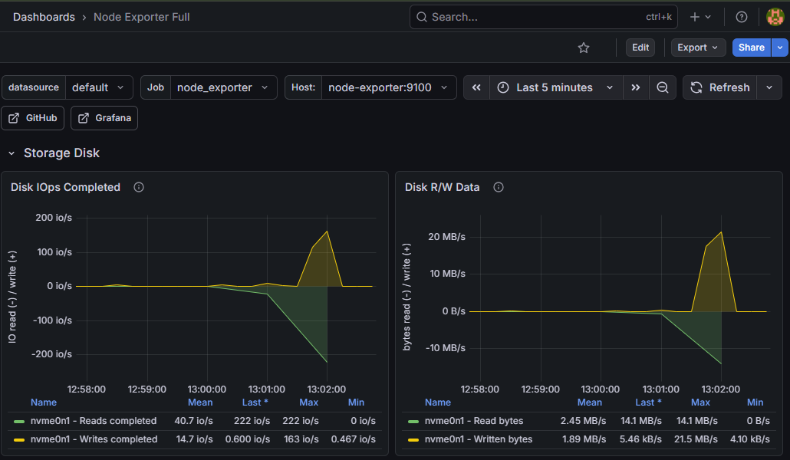
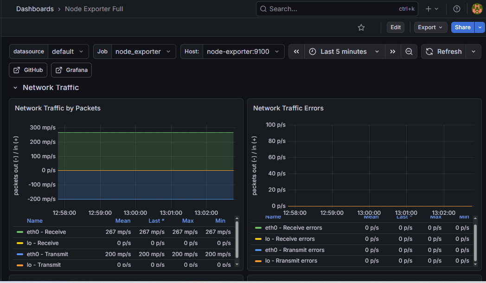

# 📊 AWS Observability Stack: Prometheus & Grafana com Docker

## 🎯 Resumo do Projeto
Implementação de uma camada de **Observabilidade** completa para monitorar instâncias EC2 na AWS. O projeto utiliza Docker Compose para orquestrar o **Prometheus** (coleta de métricas), **Node Exporter** (exportação de dados do hardware) e **Grafana** (dashboards dinâmicos).

## 🚀 Validação e Stress Test
Para garantir que o monitoramento estava preciso e em tempo real, executei um teste de carga (stress) diretamente no processador da instância EC2.

### 1️⃣ Gatilho de Carga (Stress Test)

> *Execução do container de stress via SSH para elevar o uso de recursos do sistema.*

### 2️⃣ Monitoramento de CPU em Tempo Real

> *O Grafana capturando instantaneamente o pico de processamento (CPU atingindo 100%).*

### 3️⃣ Métricas de Disco e I/O

> *Monitoramento detalhado de leitura/escrita e uso de armazenamento.*

### 4️⃣ Tráfego de Rede

> *Análise de throughput de rede (Inbound/Outbound) da instância AWS.*

### 5️⃣ Visão Geral da Infraestrutura

> *Painel consolidado mostrando a saúde geral, uptime e principais indicadores do servidor.*

## 🛠️ Tecnologias Utilizadas
* **AWS EC2**: Infraestrutura escalável na nuvem.
* **Docker & Docker Compose**: Containerização e orquestração dos serviços.
* **Prometheus**: Banco de dados de série temporal para coleta de métricas.
* **Node Exporter**: Coletor de métricas de hardware e SO para sistemas *nix.
* **Grafana**: Plataforma de análise e visualização de dados.

---
**Desenvolvido por Gustavo - Cloud & DevOps Engineer.**
